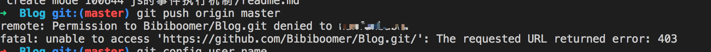
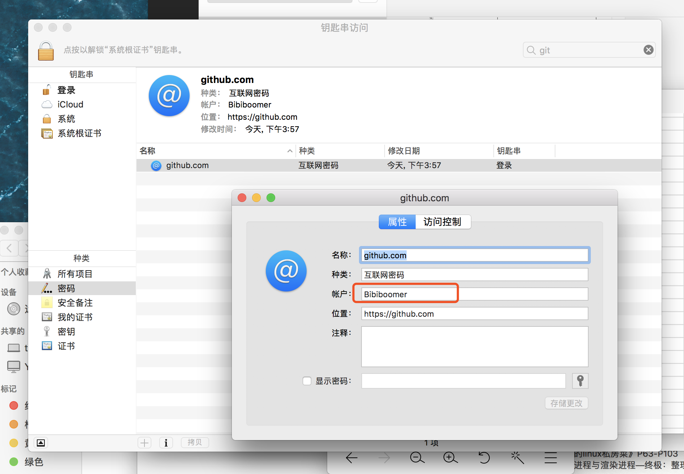

# git push 报错

## 图示

## 场景
>这里之所以存在userA，是因为有次某人在我的电脑上登录了自己git地址，创建了远程仓库；同时在本地建立了连接，这个过程输入了某人的即userA账号的信息。 
- 两个用户 Bibiboomer 和 userA ，Bibiboomer的github项目名为Blog。地址https://github.com/Bibiboomer/Blog.git/
- Bibiboomer想要进行push操作，把Blog项目新增的内容推送到远程，报错，如图示
- 打码部分是userA，即项目Blog 没有对userA开放权限
- 第一反应：输入git config user.name，返回Bibiboomer
- 奇怪，此时登录的账户是Bibiboomer，那怎么会无法push自己的项目Blog呢

## goole解决
百度到参考资料后，由于根据资料，

### goole出来的原因
由于该电脑使用git bash配过SSH，系统已经将指向github.com的用户设置为了userA，每次push操作的时候，都将读取到userA的用户信息，类似于记住密码。

### 如何解决？ 
1、对Bibiboomer生成SSH公钥，添加到userA的github后台； 
2、将userA添加为Bibiboomer项目的contributer； 
3、移除计算机中的userA

### 只考虑第三种方案
mac:启动台→钥匙串访问,如下图所示，会发现这里的账户名称是userA，现在我已经改回Bibiboomer，框框内~

window:参考资料
参考资料：https://blog.csdn.net/klxh2009/article/details/76019742

