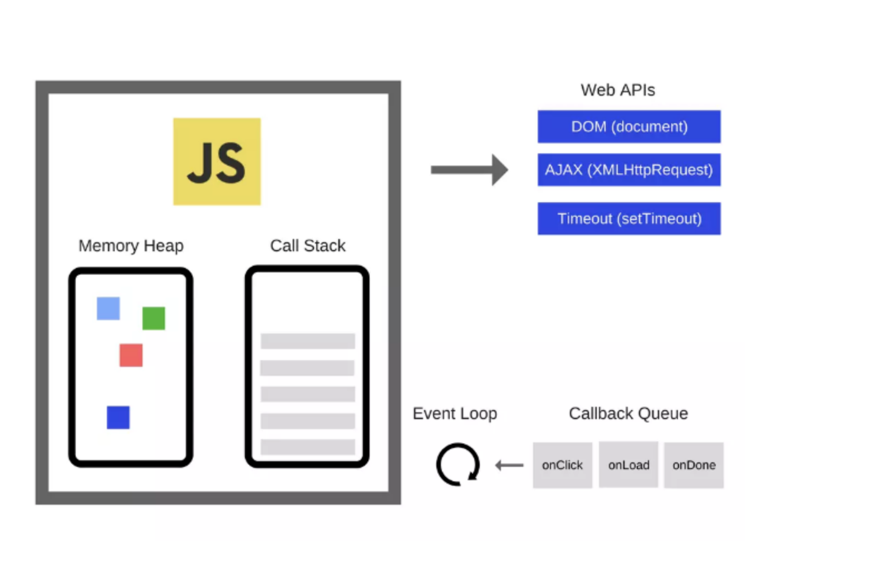

# js的事件循环机制

- 执行上下文(Execution context):函数的执行上下文
- 函数调用栈(call stack): 位于V8引擎内部
- 队列数据结构(queue): 调用栈是一种数据结构，先进先出

事件循环是什么?

如上图，v8引擎是由两个部分组成的，内存堆：这是内存分配发生的地方；调用栈：这是你的代码执行时的地方。<br>
**主线程运行的时候，产生堆（heap）和栈（stack）**。栈中的代码调用各种外部API，它们在任务队列中加入各种事件（click，load，done）。只要栈中的代码执行完毕，主线程就会去读取“任务队列”，依次执行那些事件，所对应的回调函数。<br>
执行栈中的代码（同步任务），总是在读取“任务队列”（异步任务）之前执行<br>
函数调用栈(call stack)是代码执行的地方，由主线程创建。函数执行的过程是将函数执行上下文压入栈 ***即调用栈*** 中，直到栈中清空，表示这个任务执行结束。<br>
以上是针对同步任务的执行设计，但是在浏览器，可能存在大量的网络请求，这些网络请求返回所用时间不可控，若过长则会导致浏览器堵塞住。
为了保证异步的函数按顺序执行，出现了task queue（任务队列）即callback queue。任务队列的作用是将各种**事件或异步的操作进行通知时加入事件或异步回调函数**，并非异步任务本身全部加入。<br>
js引擎会不停的从任务队列中取出任务，压入到栈中执行，执行完成后再取下一个任务执行，如此一直到任务队列为空。如果为空，会一直等待新的任务出现。这种不停的等待处理事件的循环称之为事件循环，它是一种运行机制

事件循环的作用，——监控调用栈（可以理解为主线程，同步任务在主线程上执行）和回调队列。若调用栈（存放异步任务的回调函数）是空的-***即所有的同步任务执行完毕后***，事件循环便会取出队列中的第一个事件，然后将它放入调用栈，去执行。


简言之：
1. 所有同步任务都在主线程上执行，形成一个执行栈（execution context stack）。<br>
2. 主线程之外，还存在一个“任务队列”（task queue），只要异步 
   任务有了运行结果，就在“任务队列”中放置一个事件 ***异步任务的回调函数*** 。<br>
3. 一旦“执行栈”中的所有同步任务执行完毕，系统就会读取“任务队      
   列”，看看里边有哪些事件。哪些对应的异步任务，于是结束等待 
   状态，进入“执行栈”开始执行。<br>
4. 主线程不断重复上边的第三步。<br>


程序先执行同步任务，再执行异步任务。同步任务：宏任务与微任务
- 同步任务：new Promise;await后面的会被转换为Promise，script(整体代码), setTimeout, setInterval, setImmediate, I/O, UI rendering
- 微任务：then 
- 异步：有异步任务的异步执行，即异步任务的回调函数

## 实例代码

```
console.log(1);

setTimeout(() => {
  console.log("我是定时器，延迟0S执行的");
}, 0);

new Promise((resolve, reject) => {
  console.log("new Promise是同步任务里面的宏任务");
  resolve("我是then里面的参数，promise里面的then方法是宏任务里面的微任务");
}).then(data => {
  console.log(data);
});

console.log(2);
```
分析：
第一步：首先执行到console代码，同步，打印：1
第二步：执行定时器，回调函数console.log("我是定时器，延迟0S执行的")被放入任务队列，等待同步任务执行结束
第三步：new promise，同步，打印：new Promise是同步任务里面的宏任务
第四步：then 为同步任务中的微任务，需要等待此次轮询所有的同步任务结束后才执行
第五步：执行到最后的console，同步，打印：2
第六步：此时所有的同步任务中的宏任务执行完毕，紧接着执行微任务then，打印：我是then里面的参数，promise里面的then方法是宏任务里面的微任务
第七步：此时同步任务已经执行完毕，开始执行任务队列中的回到函数，即定时器的回调函数，打印：我是定时器，延迟0S执行的
最终结果：
1
new Promise是同步任务里面的宏任务
2
我是then里面的参数，promise里面的then方法是宏任务里面的微任务
我是定时器，延迟0S执行的

#js异步方案

后续的整理点如下

- 为什么认为promise比传统的异步解决方案-（回调函数与事件）更合理与强大
- Promise到async/await，原生实现Promise以及async/await
- Promise的缺点展示出async的优点
- 异常错误的处理（catch或者try...catch）
- async的本质（返回一个Promise对象）
- 使用async的时候应该注意些什么


相关参考地址：https://github.com/yonglijia/JSPI/blob/master/How%20to%20implement%20a%20Promise.md
https://juejin.im/post/5a221d35f265da43356291cc#heading-0
https://segmentfault.com/a/1190000016994957?utm_source=tag-newest
https://www.cnblogs.com/lsgxeva/p/7976217.html
https://www.jianshu.com/p/fb1c07b4d90d